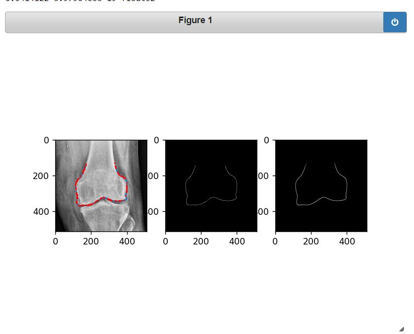
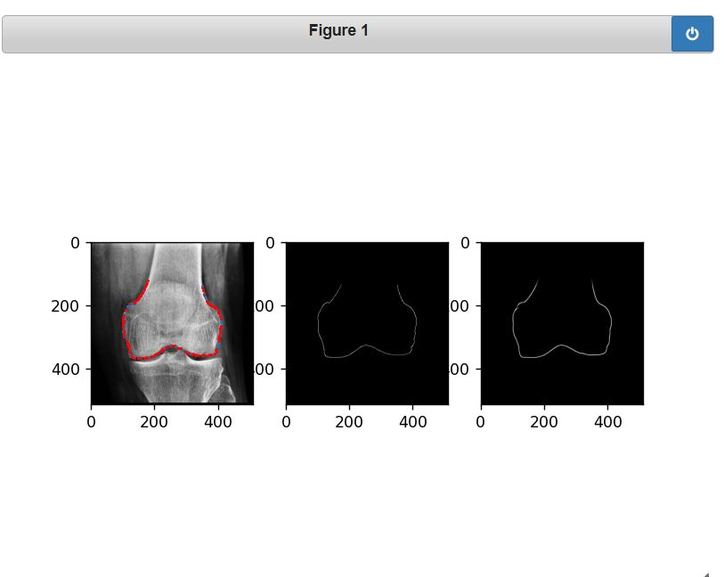
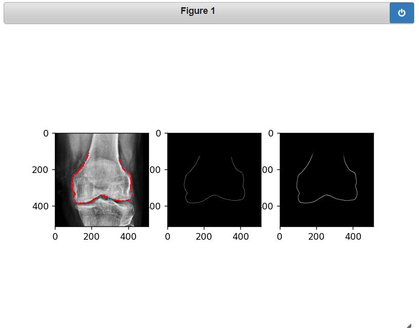

# Automatic-Knee-Contour-Detection-Using-U-net-Segmentation
U-net based Bio Medical Image Segmentation approach for Knee X-rays to automate contour extraction on femur bone
When working at [AlgoSurg](https://www.linkedin.com/company/algosurg/) I came across this interesting problem of automating contour extraction of knee-bones, these contours help drive surgeon's decision about the surgery, manually annotating takes lot of efforts and time for a fairly repeatitive task thus neural networks come to rescue

My solution is based on main U-net architecture but there are some fine changes that I implemented by getting insprired from the papers mentioned in references

* I have used same filters model thus keeping filters=128 throughout the U-net
* I have used Average Pooling instead of maxpooling

Dataset is not included in the github as it is proprietary
Thanks to AlgoSurg for letting me publish this code

I first tried to solve this problem using landmark detection but I soon realised that the problem is more similar to edge detection and therefore I used segmentation type approach and optimized Binary Cross Entropy Loss
I tried many different architectures such as Dilated Residual U-net, Stack U-net 

## References
[Heatmap Regression 2016](https://link.springer.com/chapter/10.1007/978-3-319-46723-8_27) 
[Heatmap Regression 2019](https://www.sciencedirect.com/science/article/pii/S1361841518305784) 
[Christian Payer et al. Github](https://github.com/christianpayer) 
[2D Dilated Residual U-net](https://arxiv.org/abs/1905.07710) 
[Stack U-net](https://arxiv.org/abs/1804.11294) 

## Output
### Legends
* Middle one is ground truth hand annotated 
* Right most is the predicted image
* Red points are predicted points extracted and downsampled from predicted image
* Blue Points are hand annotated points

#### 1.
 
#### 2.
 
#### 3.
 
#### 4.
 
#### 5.
 
#### 6.
 